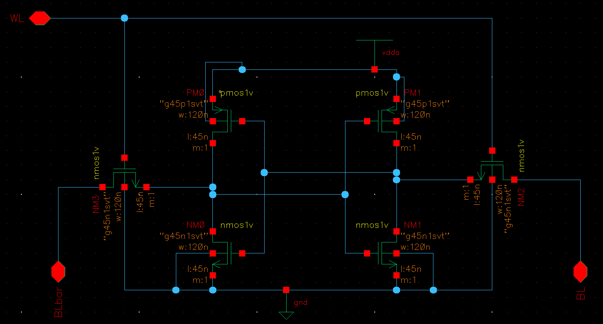

# EECS217 - VLSI Design Project Report - image

## Project Requirement

## Design

### Memory Cell
#### Gate-level memory cell draft

#### Memory cell circuit

#### Memory cell layout

### Column Decoder
#### Column decoder circuit

#### Column decoder layout

### Row Decoder
#### Row decoder circuit

#### Row decoder layout

### Overall
#### Gate level

#### Layout

## Evaluation
### Single Cell Simulation Waveforms
#### 1 -> 0 

#### 0 -> 1

### Extracted Simulation

### Component Area

|Components|Length/μm|Width/μm|Area/μm^2|
|----------|---------|---------|---------|
|SRAM Cell| 4.375 | 3.695 | 16.1656 |
|Row Decoder|67.69|11.965|809.9109|
|Column Decoder|2.555|10.52|26.8786|
|16x16 Memory Block|79.69|89.79|7155.3651|

